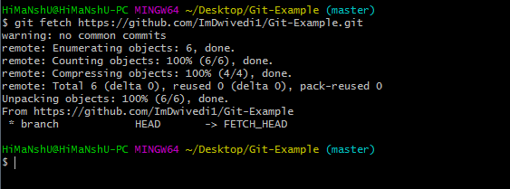

# Program ရေးသူတိုင်း သိသင့်တဲ့ အသုံးအများဆုံး git command များ

## 1. `git init`

`git init` ကတော့ ကိုယ့်ရေးနေတဲ့ program တွေပါတဲ့ folder ကို remote repo မှာသွားသိမ်းဖို့ local repo အနေနဲ့ initialize လုပ်လိုက်တာပါ။

::: tip Usage
Just `git init`
:::

### Output


## 2. `git clone`

`git clone` ကတော့ remote repo ကို ကိုယ့် local system ထဲ download ဆွဲတဲ့ သဘောပါ။

:::tip Usage
`git clone remote_url`
For example, `git clone https://github.com/loratech/sharing.loratech.org.git`
:::

### Output


## 3. `git add`

`git add` ဆိုတာကတော့ ကိုယ့်ရေးထားတဲ့ file ကို remore repository မှာသွားသိမ်းဖို့ file တွေကို register လုပ်လိုက်တဲ့ သဘောပါ။

:::tip Usage
`git add file_name`
For example, `git add demo.py` for adding each file, or `git add .` for all files
:::

### Output

<!--  -->

## 4. `git commit`

`git commit` ကတော့ ခုနက register လုပ်ပြီးသား file တွေကို သိမ်းပါမယ်လို့ `git` ကိုပြောလိုက်တဲ့ သဘောပါ။

:::tip Usage
`git commit -m 'commit message'`, `-m` stands for message.
For example, `git commit -m 'added post of git commands'`
:::

### Output

<!--  -->

## 5. `git push`

`git push` ကတော့ ခုနကသိမ်းပါမယ်လို့ ပြောထားတဲ့ file တွေကိုကိုယ့်ရဲ့ remote repository (eg. github repo / gitlab repo) မှာ upload သွားလုပ်လိုက်တာပါ။

:::tip Usage
`git push origin branch_name`, `origin` means any remote repo.
For example, `git push origin master` for `master` branch, `git push origin git-commands` for `git-commands` branch.
:::

### Output

<!--  -->

## 6. `git fetch`

`git fetch` ကတော့ `git pull` အတိုင်းပါပဲ။ But, သူက changes တွေကို download ဆွဲရုံပါပဲ။ file တွေကို update မလုပ်ပေးပါဘူး။

:::tip Usage
Just `git fetch`, for simple fetching.
:::

### Output

<!--  -->

## 7. `git merge`

`git merge` ကတော့ ခုနက `git pull` ထားတဲ့ changes / updates တွေကို update လုပ်ပေးတာပါ။

:::tip Usage
`git merge branch_name`.
For example, `git merge master` means I will merge the **changes happened in master** to **my working branch**.
:::

### Output

<!--  -->

**Before**

```sh
|---A---B---C---D---master
         \----your-branch
```

**After**

```sh
|---A---B---C---D---master---master
         \----your-branch----/
```

`git merge` creates one new commit for merging. Here, `master` and `your-branch` got merged and become `master`.

## 8. `git pull`

`git pull` ကတော့ ကိုယ့်ရဲ့ remote repository မှာဖြစ်သွားတဲ့ changes or updates တွေကို ကိုယ့်ရဲ့ local repository (eg. ကို့ယ့် laptop ထဲက folder) ဆီ download ဆွဲယူတဲ့ သဘောပါ။ Updates / Changes တွေကိုပဲ download ဆွဲတာပြီး file တွေကိုတခါတည်း update လုပ်ပေးပါတယ်။ Duplicate မဖြစ်သွားပါဘူး။
တနည်းအားဖြင့် `git pull` သည် `git fetch + git merge` ပါ။

:::tip Usage
Just `git pull`.
:::

:::warning
`git pull` will show you error if there are conflicts in merging.
:::

### Output

<!--  -->

## 9. `git status`

`git status` ကတော့ ခုနက `git init` လုပ်ပြီးရင် ကိုယ့်ရဲ့ local repo ရဲ့ အ‌ခြေအနေတွေကို ကြည့်လို့ရပါတယ်။

:::tip Usage
Just `git status` for simple usage.
:::

### Output


## 10. `git branch`

`git brach` ကတော့ ကိုယ့်ရဲ့ local repo မှာ branch ဘယ်နှစ်ခုခွဲထားလဲ / ဘယ်နှစ်ခုရှိနေလဲကြည့်တဲ့ သဘောပါ။

:::tip Usage
Just `git branch` for simple usage.
:::

### Output


## 11. `git checkout`

`git checkout` ကတော့ branch ၁ခုကနေ တခြား branch ကိုပြောင်းလို့တဲ့အခါမှာသုံးပါတယ်။

:::tip Usage
`git checkout branch_name`
For example, `git checkout master`
:::

### Output


Since I have changes in my repo, it will show some extra output otherwise it will just shows `Switch to branch branch_name`.

:::tip Creating branch with `checkout`
`git checkout -b branch_name` for creating and checking out to that created branch.
For example, `git checkout -b git-commands`
:::

### Output


## 12. `git rebase`

`git rebase` ကတော့ `git pull` လို့အဆင်မ‌ပြေတဲ့ အခြေအနေ၊ or ကိုယ့်ရဲ့ commit တွေထဲမှာ မလိုလားအပ်တဲ့ commit တွေကိုချုံ့လိုတဲ့အခါ၊ or ကိုယ့်ရေးတဲ့ brach နဲ့ master branch conflict ဖြစ်နေတဲ့အခါမှာသုံးပါတယ်။

:::tip Usage
`git rebase branch_name`
For example, `git rebase origin/master` means it will rebase the changes happened in master into your branch.
Fun fact, many refer you are time travelling if you can rebase :D
:::

This is how `rebase` works to my knowledge.

**Before**

Let's say you are working on `your-branch` for quite some time. And, there are also some updates / changes happened to `master` branch. When you are ready to merge your changes into master, there are conflicts between `your-branch` and `master` branch. A conflict can occur when your working files are updated / changed in the branch you wish to merge in. In this case, that is `master` branch.

```sh
|---A---B---C---D---master
             \----your-branch
```

**After**

```sh
|---A---B---C---D---master
             \----D---master---your-branch
```

Now `your-branch` has history commits like `D` and `master` in other words, you can't normally `git push` to the remote repo since it has different history commits. Instead, `git push -f` would work. `-f` means force. That's why many says `rebase` is kind of time travelling.

:::warning
Since `git rebase` rewrites history, be careful when using.
:::

OK. That's all the git commands I know about. Want to learn like a kid?

Go ahead to [https://learngitbranching.js.org/](https://learngitbranching.js.org/).

Happy Gitting :tada:
