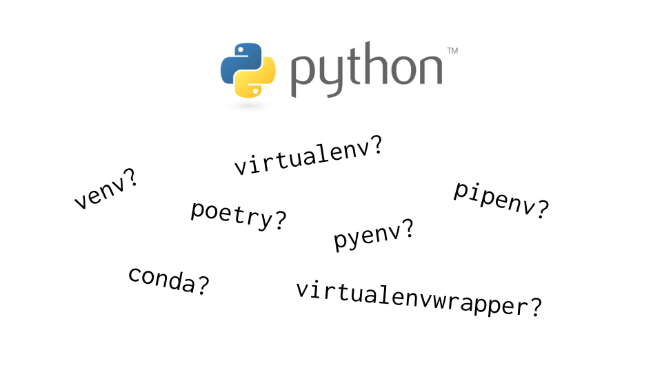

Almost every begineer after diving into python has faced which python virtual environment tool for their python projects. I am also one of them. I didn't know which one to use for my specific projects as one might do well in one kind of project, another one might do well in another kind of project. Some tools are for creating python virtual environments only while some do project scaffolding and creating python virtual environments also. So, I have tried a few of them, have searched and read a few of them namely –

- venv
- conda
- virtualenv
- pipenv
- pyenv
- poetry (scaffolding tool)

## Venv

Python Docs has recommended creating virtual environments using `venv` which has been included in python3.6+ version. It can manage multiple shells of multiple OSes. Creating virtual environments with `venv` is easy. You can follow [this guide](https://docs.python.org/3/tutorial/venv.html#creating-virtual-environments) from official python docs.

The unsatifying thing about `venv` is it uses the global python version of your OS which mean every time you create envrionments with `venv`, you will be stucked up with your global python version. This is unconvenient when you want to create environments with multiple python version. This is where `conda` comes in.

::: tip Where `venv` suitable
`venv` is suitable for small projects where you don't need to install multiple packages 📦.

Also useful for prototyping 🧪.
:::

## Conda (Anaconda or Miniconda)

Conda is a package manager of Anaconda Software Distribution. Conda is language agnostic. You can install C, C++, Python or JS packages with conda if package maintainers support conda installation. Anaconda or Miniconda creates a `base` conda environment after installing. You can check with `conda env list`. You probably don't want to work in `base` environment. It is better to [create conda environment](https://docs.conda.io/projects/conda/en/latest/commands/create.html) from the `base` conda environment. The `base` conda environment uses the global python version of your OS once you have installed Anaconda or Miniconda. But you can also specify the python version you need while creating with `conda create` postfixing `python=x.x`. You can even upgrade or downgrade the python version inside the created conda environment. `conda` also handles package dependencies so you don't have to scretch your head.

::: tip Where `conda` useful
Conda is mainly used in doing Machine Learning, Deep Learning and Data Science as it handles all the hardware accelerated packages for you 💯
:::

## Virtualenv

`virtualenv` is basically same as `venv` with more features, options for packages, library authors. I have used `virtualenv` before with python3.5. But it's no longer solid choice for me as it insists users to [install with pipx](https://virtualenv.pypa.io/en/latest/). Needing `pipx` to install has led me to choose conda over it. But you can give a try.

## Pipenv

`pipenv` is a package manager as well as virtual environment creator. It combines the abilities of `pip` and `virtualenv`. The way it works resembles the package managers of JavaScript ecosystem. It creates `Pipfile` and `Pipfile.lock` instead of `requirements.txt`. `Pipfile` contains the packages with specific package version, check dependencies management and `Pipfile.lock` contains the packages name with sha256 checksum. It also has useful command line options to give insight about your environment, checking security vulnerabilities. You can also [create with specific python version](https://github.com/pypa/pipenv#-usage) with `pipenv`.

## Pyenv

[Pyenv](https://github.com/pyenv/pyenv#simple-python-version-management-pyenv) is a special one. It is written in shell while all the above are written in python itself. It only does environment creation and changing global python versions installed on your system. Nothing fancy! Hard to use in my opinion.

## Poetry

[Poetry](https://python-poetry.org/) manages creating environments, installing packages, checking dependenices. It packs more features than the above ones. It can do

- creating environments
- checking dependencies
- testing packages
- building packages
- publishing packages
- and has beautiful command line output

::: tip Where `poetry` useful
If you want to create, test, build and publish packages, `poetry` is definitely go to tool.
:::

### Useful Medium Post

[Which Python package manager should you use?](https://towardsdatascience.com/which-python-package-manager-should-you-use-d0fd0789a250)

### References

- [https://docs.python.org](https://docs.python.org)
- [https://docs.conda.io](https://docs.conda.io)
- [https://virtualenv.pypa.io/en/latest/](https://virtualenv.pypa.io/en/latest/)
- [https://github.com/pypa/pipenv](https://github.com/pypa/pipenv)
- [https://github.com/pyenv/pyenv](https://github.com/pyenv/pyenv)
- [https://python-poetry.org/](https://python-poetry.org/)